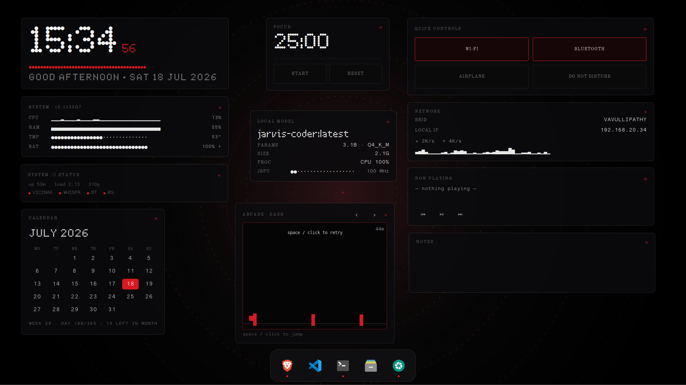

# Nothing OS — desktop

A Nothing-OS-themed interactive desktop for Linux Mint Cinnamon (X11): floating,
draggable GTK3 widgets over a live Conky background, in a dark **dot-matrix + red**
(`#D71921`) aesthetic. Everything is offline / local — no cloud calls.

 



## What's in it

**Widgets** — `nothing-widgets/nothing-widgets.py` (PyGObject/GTK3, one movable window each):

| Widget | What it shows |
|---|---|
| **Clock** | Ndot time + live seconds bar + greeting/date |
| **Quick Controls** | Wi-Fi / Bluetooth / Airplane / Do-Not-Disturb toggles |
| **System** | CPU & RAM sparklines, TMP/BAT dotted meters (pure `/proc` reads) |
| **Network** | SSID, IP, live ↓↑ throughput + sparkline |
| **Now Playing** | playerctl track + controls + audio visualiser |
| **Status** | uptime / load / procs + service dots |
| **Calendar** | dot month grid, today lit red, derived "agenda" line |
| **Focus** | Pomodoro countdown (start / pause / reset) |
| **Local Model** | live Ollama status (model · params · size · CPU/GPU) + iGPU freq |
| **Notes** | editable, autosaved to `notes.txt` |
| **Arcade** | switchable mini-games: DASH · SNAKE · REFLEX · RAIN |
| **Dock** | macOS-style live dock — open apps + pins, click to focus/launch |

**Background** — `conky/bg.lua` + `bg.conf`: CPU-reactive dotted rings, a drifting
dot field, and sonar pings (Cairo, ~5fps).

**Extras** — `bin/shot` (screenshot → save **and** clipboard), Vicinae config
(`config/vicinae-settings.json`, close-on-focus-loss), autostart entry.

## Interaction

- **Double-click + drag** a widget to move it (position persists per widget).
- **Double-click** (no drag) opens the related app.
- **Arcade**: click the board to focus, then arrows/WASD or space.
- **Notes**: click to type (the one focus-taking widget).

## Keybindings (Cinnamon)

| Key | Action |
|---|---|
| `Alt+Space` | Vicinae launcher |
| `Ctrl+Shift+S` | area screenshot |
| `Ctrl+Esc` | close active window |
| `Super+Shift+V` | Vicinae clipboard history |

## Install

Tested on Linux Mint 22.1 · Cinnamon · X11.

**1 — System packages** (Debian/Ubuntu/Mint):

```bash
sudo apt install python3-gi gir1.2-gtk-3.0 conky-all playerctl \
                 wmctrl xclip gnome-screenshot papirus-icon-theme
```

**2 — Clone & deploy:**

```bash
git clone https://github.com/Arj0010/nothing-os.git
cd nothing-os
./install.sh          # copies widgets/bg/tools into ~/.config + ~/.local/bin
```

**3 — Fonts.** The dot-matrix look needs Nothing's **Ndot** & **NType 82** plus
**Lettera Mono**. These are proprietary and **not** bundled — download the `.otf`
files yourself, drop them in `~/.local/share/fonts/`, then (Space Mono *is*
bundled):

```bash
cp fonts/*.otf ~/.local/share/fonts/ && fc-cache -f
```

Without them GTK falls back to a plain monospace — it still works, just less Ndot.

**4 — Icons** (colorful dock):

```bash
gsettings set org.cinnamon.desktop.interface icon-theme Papirus-Dark
```

**5 — Launch:**

```bash
~/.config/conky/nothing/start.sh
```

Autostart (`nothing-conky.desktop`, installed in step 2) relaunches everything
~6s after each login. Optional keybindings (Alt+Space, Ctrl+Esc, …) are set
through **Cinnamon ▸ Keyboard ▸ Shortcuts** — see the table above.

## Backup workflow

Live files are edited under `~/.config`; `./sync.sh` copies them back here, then
commit + push. Runtime state (`positions.json`, `notes.txt`) is git-ignored.

## Requirements

Cinnamon/X11, `python3-gi` (GTK3), `conky-all` (Lua+Cairo), `playerctl`,
`wmctrl`, `xclip`, `gnome-screenshot`, Papirus-Dark icons, and the Ndot / NType /
Lettera fonts in `fonts/`.
