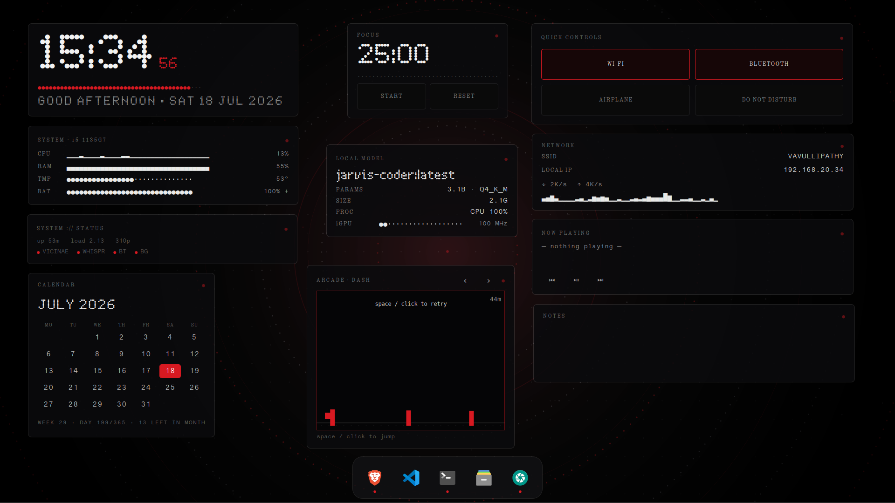

# Nothing OS — desktop

A Nothing-OS-themed interactive desktop for Linux Mint Cinnamon (X11): floating,
draggable GTK3 widgets over a live Conky background, in a dark **dot-matrix + red**
(`#D71921`) aesthetic. Everything is offline / local — no cloud calls.

 



## What's in it

**Widgets** — `nothing-widgets/nothing-widgets.py` (PyGObject/GTK3, one movable window each):

| Widget | What it shows |
|---|---|
| **Clock** | Ndot time + live seconds bar + greeting/date |
| **Quick Controls** | Wi-Fi / Bluetooth / Airplane / Do-Not-Disturb toggles |
| **System** | CPU & RAM sparklines, TMP/BAT dotted meters (pure `/proc` reads) |
| **Network** | SSID, IP, live ↓↑ throughput + sparkline |
| **Now Playing** | playerctl track + controls + audio visualiser |
| **Status** | uptime / load / procs + service dots |
| **Calendar** | dot month grid, today lit red, derived "agenda" line |
| **Focus** | Pomodoro countdown (start / pause / reset) |
| **Local Model** | live Ollama status (model · params · size · CPU/GPU) + iGPU freq |
| **Notes** | editable, autosaved to `notes.txt` |
| **Arcade** | switchable mini-games: DASH · SNAKE · REFLEX · RAIN |
| **Clean** | reclaimable-space scan, one-touch cache clean, 7-day memory timeline |
| **Dock** | macOS-style live dock — open apps + pins, click to focus/launch |

**Background** — `conky/bg.lua` + `bg.conf`: CPU-reactive dotted rings, a drifting
dot field, and sonar pings (Cairo, ~5fps).

**Extras** — `bin/shot` (screenshot → save **and** clipboard), Vicinae config
(`config/vicinae-settings.json`, close-on-focus-loss), autostart entry.

## Interaction

- **Double-click + drag** a widget to move it (position persists per widget).
- **Double-click** (no drag) opens the related app.
- **Arcade**: click the board to focus, then arrows/WASD or space.
- **Notes**: click to type (the one focus-taking widget).

## Keybindings (Cinnamon)

| Key | Action |
|---|---|
| `Alt+Space` | Vicinae launcher |
| `Ctrl+Shift+S` | area screenshot |
| `Ctrl+Esc` | close active window |
| `Super+Shift+V` | Vicinae clipboard history |

## Install

Tested on Linux Mint 22.3 (Zena) · Cinnamon · X11.

**1 — System packages** (Debian/Ubuntu/Mint):

```bash
sudo apt install python3-gi gir1.2-gtk-3.0 conky-all playerctl \
                 wmctrl xclip gnome-screenshot papirus-icon-theme
```

**2 — Clone & deploy:**

```bash
git clone https://github.com/Arj0010/nothing-os.git
cd nothing-os
./install.sh          # copies widgets/bg/tools into ~/.config + ~/.local/bin
```

**3 — Fonts.** The dot-matrix look needs Nothing's **Ndot** & **NType 82** plus
**Lettera Mono**. These are proprietary and **not** bundled — download the `.otf`
files yourself, drop them in `~/.local/share/fonts/`, then (Space Mono *is*
bundled):

```bash
cp fonts/*.otf ~/.local/share/fonts/ && fc-cache -f
```

Without them GTK falls back to a plain monospace — it still works, just less Ndot.

**4 — Icons** (colorful dock):

```bash
gsettings set org.cinnamon.desktop.interface icon-theme Papirus-Dark
```

**5 — Launch:**

```bash
~/.config/conky/nothing/start.sh
```

Autostart (`nothing-conky.desktop`, installed in step 2) relaunches everything
~6s after each login. Optional keybindings (Alt+Space, Ctrl+Esc, …) are set
through **Cinnamon ▸ Keyboard ▸ Shortcuts** — see the table above.

## CLEAN :// widget

Opens from the rail (`◌`). Sizes every cache it knows about, and `CLEAN NOW`
empties the safe ones in one tap. The rail icon shows the reclaimable total, so
you can tell there's something to clean without opening the card.

- **Held targets** (`~/.cache/puppeteer`, `~/.cache/uv`) are sized and shown but
  never auto-cleaned — deleting them costs a ~600 MB re-download or slow rebuilds.
  Each has its own `×`.
- **Every deletion is path-guarded** to `~/.cache` and `~/.local/share/Trash`;
  contents go, the directory stays, and symlinks pointing outside are unlinked
  rather than followed. The logic lives in `nothing-widgets/cleaner_core.py` with
  tests in `test_cleaner_core.py` (`python3 nothing-widgets/test_cleaner_core.py`).
- **Apps come back.** `~/.cache/vicinae` is cleared with `vicinae.service` stopped
  around it; anything else watched (conky) that dies during a clean is relaunched,
  and the card reports `RESTARTED …`.
- **The memory timeline** samples top processes every 30 s to a 7-day rolling log,
  showing per-app peak RSS. `KILL` sends `SIGTERM` only and asks `SURE?` first.
- **`PERF` switch** toggles the power profile. It drives `powerprofilesctl`, not
  `scaling_governor` — `power-profiles-daemon` owns CPU policy here and reverts
  hand-written sysfs values. Needs no root (PPD exposes it over polkit), and it is
  a plain toggle with no `SURE?` because it is instantly reversible. Measured
  2701 → 3765 MHz. The row says `ON BATTERY` when unplugged, since PPD keeps a
  lower ceiling regardless of the profile selected.
- **No `drop_caches`.** It would discard useful page cache and make the machine
  slower, not faster.

The two root-owned targets (apt cache, journal) need a pinned sudoers rule:

```bash
./install.sh --with-cleaner-sudo     # validates with visudo before installing
```

Without it those rows read `AUTH` and `CLEAN NOW` skips them — nothing hangs.

## System updates

An `apt` upgrade never touches `$HOME`, so the widgets, conky config, fonts and
Vicinae settings are not at risk. Two things are:

1. **`/etc` files you have modified** — dpkg offers to replace them. On this
   machine that's `zram-generator.conf`, `default-wifi-powersave-on.conf` and
   `cryptsetup-initramfs/conf-hook`.
2. **Cinnamon dconf settings** — panel layout, keybindings, themes. Safe in
   practice, but worth being able to prove.

Both are recorded in `docs/desktop-state/`, and:

```bash
./bin/mint-update --dry-run        # see what would change
./bin/mint-update                 # upgrade, keeping every /etc file you edited
./bin/mint-update --prune-kernels # drop old kernels, keep running + 1 fallback
./bin/verify-desktop              # report drift against the recorded baseline
./bin/verify-desktop --update     # accept current state as the new baseline
```

`--prune-kernels` exists because `apt autoremove` will not remove them: a kernel
that was ever installed explicitly is marked MANUAL, and autoremove only reaps
automatic packages. That left 5 old kernels and ~845 MB on a 90%-full disk here.
It always keeps the running kernel plus the newest other one, and refuses to run
if the running kernel somehow lands in the removal list.

`mint-update` runs `apt upgrade` (never `full-upgrade`, which can remove packages
to satisfy dependencies), passes `--force-confold` so your config files win, lists
anything held back rather than forcing it, and finishes by running
`verify-desktop`. Where dpkg keeps your file it parks the new one as
`*.dpkg-dist`, and the script points them out.

It needs your sudo password. In a terminal it asks there; with no controlling
terminal — an agent, a hotkey, a `.desktop` launcher — it pops a zenity dialog on
`$DISPLAY` instead, because `sudo` otherwise aborts with "a terminal is required"
before doing any work.

## Local-model tuning

```bash
./bin/llm-tune status   # power profile, AVX-512 features, zram, Intel GPU stack
./bin/llm-tune on       # performance power profile
./bin/llm-tune off      # back to balanced
./bin/llm-tune bench    # single-thread STREAM triad
```

Needs no sudo — `power-profiles-daemon` exposes this over polkit to the active
session. That's also *why* it uses `powerprofilesctl` rather than writing
`scaling_governor`: PPD is what actually sets CPU policy here, so hand-written
sysfs values get reverted the next time the daemon re-asserts itself.

Measured on this machine (i5-1135G7, on battery): balanced **15.0 GB/s** →
performance **17.4 GB/s** single-thread triad, with core clocks going 2900 →
3800 MHz. CPU inference is memory-bandwidth-bound, so that bandwidth number
tracks tokens/sec more closely than clock speed does.

`vm.swappiness` is deliberately left at 140. It looks alarming next to the stock
60, but this machine swaps to zram (8 GB, compressed RAM) and a high value is the
correct pairing. Lowering it trades "model pages get compressed" for "model pages
go to disk", which is worse.

## Backup workflow

Live files are edited under `~/.config`; `./sync.sh` copies them back here, then
commit + push. Runtime state (`positions.json`, `notes.txt`,
`cleaner-history.jsonl`) is git-ignored.

## Requirements

Cinnamon/X11, `python3-gi` (GTK3), `conky-all` (Lua+Cairo), `playerctl`,
`wmctrl`, `xclip`, `gnome-screenshot`, Papirus-Dark icons, and the Ndot / NType /
Lettera fonts in `fonts/`.
